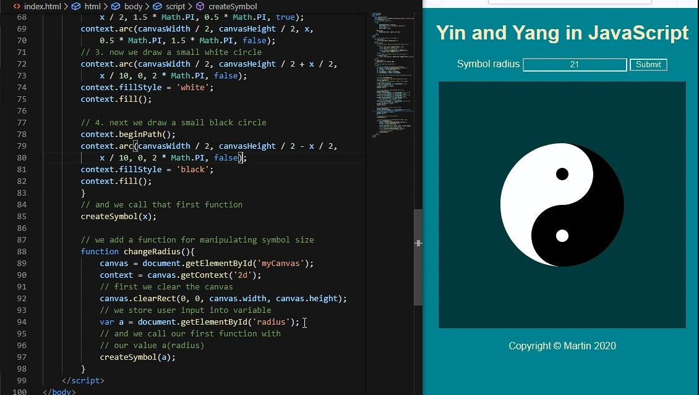

# Yin and Yang Symbol in JavaScript
using JavaScript to draw Yin and Yang symbol

# Features:
* Compact HTML page with CSS, JS and comments to draw Yin and Yang symbol
* User input for size of the symbol

# To save generated image:
* Just right-click on it and choose 'Save As'

